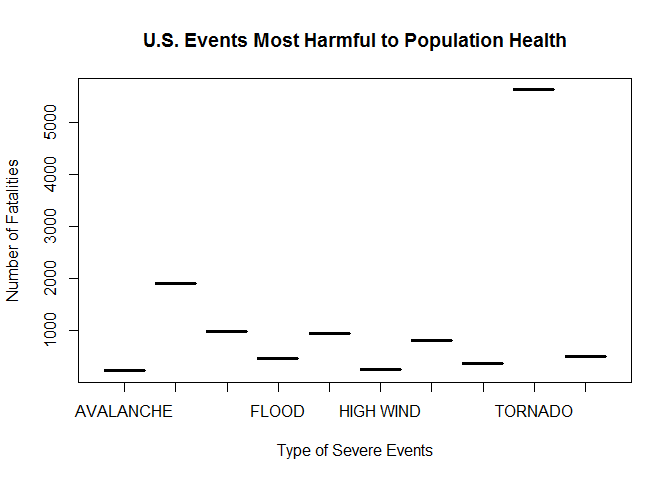
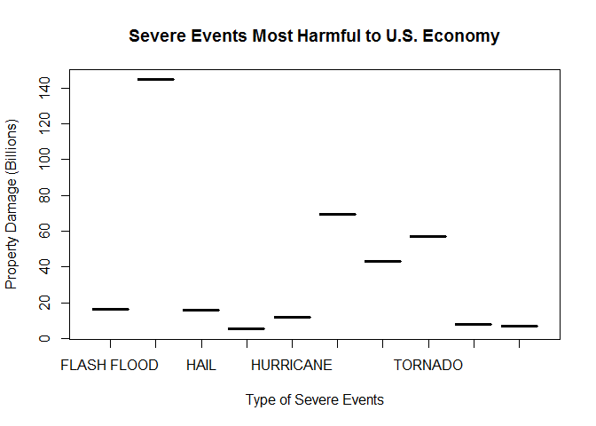

##NOAA Data: Severe Weather Events

######(NOTE:The following published documentation has been designed to meet the requirements of on-line Coursera Course: Reproducible Research, Peer Assessment 2. References for this course and publication may be found at the end of this document.)

##Synopsis

####The following data analysis of the U.S. National Oceanic and Atmospheric Administration's (NOAA)   [Storm Data](https://d396qusza40orc.cloudfront.net/repdata%2Fdata%2FStormData.csv.bz)
####is essential in aiding government and municipal managers. Data included has been analyzed to promote more effective preparation and prioritization of emergency resources in the case of severe weather 

###Data analysis focus is two-fold:

####1)	U.S. severe weather events or EVTYPE (i.e. EVent TYPE variables) highlights data while isolating the most severe weather. Such severe U.S. events includes thunderstorms, tornados and flooding. These have been described by NOAA as harmful to population health resulting in: a) injuries and b) fatalities.
####2)	NOAA storm data has shown that U.S. greatest economic impact from severe weather events results in: a) property damage and b) crop damages.

##Data Processing:

####This section describes (in words and code) how NOAA's storm event database records (1950 to November 2011) were loaded into R and processed for analysis. 
####-The data analysis starts from the raw .CSV file [Storm Data 47Mb](https://d396qusza40orc.cloudfront.net/repdata%2Fdata%2FStormData.csv.bz2)
####-No pre-processing occurs outside this document. 
####-Data processing and analysis was conducted using R version (x64 3.2.1) within RStudio version (0.99.467). 

###A step-wise approach for processing of NOAA storm data: 

####Step 1: Exploration includes data preparation involving initial project preparation and set up in RStudio.
####If you are new to RStudio the following instructions may prove helpful in creating a new Reproducible Research - Peer Assessment 2 Project in RStudio:

####Execute a new project in RStudio (Available for Windows, Macs and Linux and  looks the same across all three operating systems):

#####1. Click File >> New Project (by using the Project pull down menu in the upper right hand corner)
#####2. Click Version
#####3. Choose Git
#####4. Enter URL for the Git Repository, as well as the folder where this may be cloned
#####5. Type filename
#####6. Clicking Tools >> Global Options brings up RStudio options settings

####Set working directory in console pane in RStudio:
#####1. Click Session >> Set Working Directory >> Choose Directory
#####2. In Console pane > getwd() to ensure the working directory is correct

####Create a new R file:
##### Click File >> New File >> R Script

####Install R Packages: 
#####1. Click Packages on the pane layout tab
#####2. Click Install on the pane layout tab
#####3. Type package name under Packages
#####4. Click Install 

####Load libraries into R console:

####library(knitr)
####library(R.utils)
####library(dplyr)
####library(stringr)

####Step 2: Data sets with large numbers of variables require preliminary selection operations to bring the number of variables into a manageable range.Justification for selecting subsets of storm data records focuses on NOAA two quantifiable variables: FATALITIES and INJURIES.
####- The raw NOAA Storm dataset consists of a .csv file compressed via [bzip2](www.bzip.org/) which may be downloaded from the web.  

####- Additional documentation about this dataset includes:

####[National Weather Service Documentation](https://d396qusza40orc.cloudfront.net/repdata%2Fpeer2_doc%2Fpd01016005curr.pdf)  

####[National Climatic Data Center Storm Events](https://d396qusza40orc.cloudfront.net/repdata%2Fpeer2_doc%2FNCDC%20Storm%20Even####ts-FAQ%20Page.pdf) 

####Download [Storm Data](https://d396qusza40orc.cloudfront.net/repdata%2Fdata%2FStormData.csv.bz2 to the #### working directory): 
- Move dataset to the R working directory. 
- Click the Environment tab >> Import dataset >> from the working directory which will import the raw data file.
- The resulting raw .csv data file is 409.4 MB including 902,297 entries
or objects with 37 variables.
 
####- Read raw dataset into memory in RStudio by selecting the Environment tab and importing the dataset from the working directory:


```r
data <- read.csv("repdata-data-StormData.csv.bz2", header=TRUE, na.strings = "")
```
####- Time-consuming pre-processing can utilize the cache = TRUE option for certain code chunks.


```r
cache = TRUE
```


```r
dim(data)
```

```
## [1] 902297     37
```
####- The head function will print several row for a preliminary view of the of the dataset:


```r
head(data)
```

```
##   STATE__           BGN_DATE BGN_TIME TIME_ZONE COUNTY COUNTYNAME STATE
## 1       1  4/18/1950 0:00:00     0130       CST     97     MOBILE    AL
## 2       1  4/18/1950 0:00:00     0145       CST      3    BALDWIN    AL
## 3       1  2/20/1951 0:00:00     1600       CST     57    FAYETTE    AL
## 4       1   6/8/1951 0:00:00     0900       CST     89    MADISON    AL
## 5       1 11/15/1951 0:00:00     1500       CST     43    CULLMAN    AL
## 6       1 11/15/1951 0:00:00     2000       CST     77 LAUDERDALE    AL
##    EVTYPE BGN_RANGE BGN_AZI BGN_LOCATI END_DATE END_TIME COUNTY_END
## 1 TORNADO         0    <NA>       <NA>     <NA>     <NA>          0
## 2 TORNADO         0    <NA>       <NA>     <NA>     <NA>          0
## 3 TORNADO         0    <NA>       <NA>     <NA>     <NA>          0
## 4 TORNADO         0    <NA>       <NA>     <NA>     <NA>          0
## 5 TORNADO         0    <NA>       <NA>     <NA>     <NA>          0
## 6 TORNADO         0    <NA>       <NA>     <NA>     <NA>          0
##   COUNTYENDN END_RANGE END_AZI END_LOCATI LENGTH WIDTH F MAG FATALITIES
## 1         NA         0    <NA>       <NA>   14.0   100 3   0          0
## 2         NA         0    <NA>       <NA>    2.0   150 2   0          0
## 3         NA         0    <NA>       <NA>    0.1   123 2   0          0
## 4         NA         0    <NA>       <NA>    0.0   100 2   0          0
## 5         NA         0    <NA>       <NA>    0.0   150 2   0          0
## 6         NA         0    <NA>       <NA>    1.5   177 2   0          0
##   INJURIES PROPDMG PROPDMGEXP CROPDMG CROPDMGEXP  WFO STATEOFFIC ZONENAMES
## 1       15    25.0          K       0       <NA> <NA>       <NA>      <NA>
## 2        0     2.5          K       0       <NA> <NA>       <NA>      <NA>
## 3        2    25.0          K       0       <NA> <NA>       <NA>      <NA>
## 4        2     2.5          K       0       <NA> <NA>       <NA>      <NA>
## 5        2     2.5          K       0       <NA> <NA>       <NA>      <NA>
## 6        6     2.5          K       0       <NA> <NA>       <NA>      <NA>
##   LATITUDE LONGITUDE LATITUDE_E LONGITUDE_ REMARKS REFNUM
## 1     3040      8812       3051       8806    <NA>      1
## 2     3042      8755          0          0    <NA>      2
## 3     3340      8742          0          0    <NA>      3
## 4     3458      8626          0          0    <NA>      4
## 5     3412      8642          0          0    <NA>      5
## 6     3450      8748          0          0    <NA>      6
```


```r
length(unique(data$EVTYPE))
```

```
## [1] 985
```

####- According to the [NOAA website](http://www.ncdc.noaa.gov/stormevents/details.jsp?type=eventtype) 

####- The most relevant, unbiased data to meet our focused objective on events causing the greatest risk to population health begins in 1996.

####- There are 48 event types that will be reviewed to bring the number of variables into a manageable range.

####- Filter the raw data down (1996 to November 2011).

####- Select only the focused NOAA data above on two quantifiable variables: FATALITIES and INJURIES.

####- Identify the various weather event types recorded in the NOAA Storm dataset. 


```r
harmful_event_data <- filter(data, as.numeric(format(as.Date(as.character(data$BGN_DATE), "%m/%d/%Y %H:%M:%S"), "%Y")) >= 1996)
```


```r
dim(harmful_event_data)
```

```
## [1] 902297     37
```


```r
colnames(data)
```

```
##  [1] "STATE__"    "BGN_DATE"   "BGN_TIME"   "TIME_ZONE"  "COUNTY"    
##  [6] "COUNTYNAME" "STATE"      "EVTYPE"     "BGN_RANGE"  "BGN_AZI"   
## [11] "BGN_LOCATI" "END_DATE"   "END_TIME"   "COUNTY_END" "COUNTYENDN"
## [16] "END_RANGE"  "END_AZI"    "END_LOCATI" "LENGTH"     "WIDTH"     
## [21] "F"          "MAG"        "FATALITIES" "INJURIES"   "PROPDMG"   
## [26] "PROPDMGEXP" "CROPDMG"    "CROPDMGEXP" "WFO"        "STATEOFFIC"
## [31] "ZONENAMES"  "LATITUDE"   "LONGITUDE"  "LATITUDE_E" "LONGITUDE_"
## [36] "REMARKS"    "REFNUM"
```

#### Most Relevant Variable and Descriptions:

#####STATE: State events took place

#####EVTYPE: Event Type (e.g. tornado, flood, etc.)

#####FATALITIES: Number of fatalities

#####INJURIES:Number of injuries

#####PROPDMG:Property damage estimates, entered as actual dollar amounts

#####PROPDMGEXP:Alphabetic Codes to signify magnitude "K" for thousands, "M" for millions, and "B" for billions)

#####CROPDMG:Crop damage estimates, entered as actual dollar amounts

#####CROPDMGEXP:Alphabetic Codes to signify magnitude "K" for thousands, "M" for millions, and "B" for billions),

####- Out of the 48 event types FATALITIES and INJURIES are the most relevant to population health for determining a severe event focus.

##Results

####Step 3: The next stage of the process is to identify the most relevant event variables: Focus on FATALITIES and INJURIES to pair these variables with the greatest economic impact variables. Economic impact is quantified with variables PROPDMG, PROPDMGEXP, CROPDMG, and CROPDMGEXP.

####-Transforming the data to more easily quantify the economic impact of each variable; PROPDMG, PROPDMGEXP, CROPDMG, and CROPDMGEXP is important to plot the economic impact and provide evaluators of the data the information they require for deploying specific resources to meet specific severe weather events. 

####-The following will help to plot Property Damage and Quantify Economic Impact 


```r
data$p_DMGEXP <- 1
data$p_DMGEXP  [data$PROPDMGEXP == "K" | data$PROPDMGEXP == "k"] <- 1000
data$p_DMGEXP  [data$PROPDMGEXP == "M" | data$PROPDMGEXP == "m"] <- 1000000
data$p_DMGEXP  [data$PROPDMGEXP == "B" | data$PROPDMGEXP == "b"] <- 1000000000
data$p <- data$PROPDMG * data$p_DMGEXP
```
####- The following will help to plot Crop Damage to show Quantify Economic Impact 


```r
data$c_DMGEXP <- 1
data$c_DMGEXP [data$CROPDMGEXP == "K" | data$CROPDMGEXP == "k"] <-  1000
data$c_DMGEXP [data$CROPDMGEXP == "M" | data$CROPDMGEXP == "m"] <-  1000000
data$c_DMGEXP [data $CROPDMGEXP == "B" | data$CROPDMGEXP == "b"] <- 1000000000
data$c <- data$CROPDMG * data$c_DMGEXP
```
####- The focus is on  aggregating the FATALITIES and INJURIES variables with severe harmful events to population health and greatest economic impact.


```r
harmfulE <- aggregate(x = data[,c("FATALITIES", "INJURIES")], 
by = list(data$EVTYPE), FUN = "sum")
names(harmfulE) <- c("event", "fatalities", "injuries")
event1 <- head(harmfulE[order(-harmfulE$fatalities,harmfulE$injuries),"event"],1)
```


```r
harmful_event <- data[data$EVTYPE == event1,]
harmful_event_state <- aggregate(x = harmful_event
[,c("FATALITIES", "INJURIES")], by = list(harmful_event$STATE), FUN = "sum")
names(harmful_event_state) <- c("state", "fatalities", "injuries")
stormE <- aggregate(x = data[,c("p", "c")], by = list(data$EVTYPE), FUN = "sum")
```


```r
stormE <- aggregate(x = data[,c("p", "c")], by = list(data$EVTYPE), FUN = "sum")
names(stormE) <- c("event", "propdam", "cropdam")
event2 <- head(stormE[order(-stormE$propdam, - stormE$cropdam),"event"],1)
```


```r
se_event <- data[data$EVTYPE == event1,]
se_state <- aggregate(x = se_event[,c("p", "c")], by = list(se_event$STATE), 
FUN = "sum")
names(se_state) <- c("state", "propdam", "cropdam")
harmfulE <- head(harmfulE[order(-harmfulE$fatalities, - harmfulE$injuries),],10)
```


```r
harmfulE$event <- as.factor(as.character(harmfulE$event))
```

####- Plot Severe and Harmful Events:


```r
plot(harmfulE$event 
    ,harmfulE$fatalities
    ,type = "b"
    ,main = "U.S. Events Most Harmful to Population Health"
    ,xlab = "Type of Severe Events"
    ,ylab = "Number of Fatalities")
```

 


```r
harmfulE
```

```
##              event fatalities injuries
## 834        TORNADO       5633    91346
## 130 EXCESSIVE HEAT       1903     6525
## 153    FLASH FLOOD        978     1777
## 275           HEAT        937     2100
## 464      LIGHTNING        816     5230
## 856      TSTM WIND        504     6957
## 170          FLOOD        470     6789
## 585    RIP CURRENT        368      232
## 359      HIGH WIND        248     1137
## 19       AVALANCHE        224      170
```


```r
as.character(event1)
```

```
## [1] "TORNADO"
```


```r
head(harmful_event_state [order(-harmful_event_state $fatalities, harmful_event_state $injuries),],10)
```

```
##    state fatalities injuries
## 2     AL        617     7929
## 45    TX        538     8207
## 26    MS        450     6244
## 25    MO        388     4330
## 3     AR        379     5116
## 44    TN        368     4748
## 37    OK        296     4829
## 16    IN        252     4224
## 23    MI        243     3362
## 17    KS        236     2721
```


```r
stormE_most_harmful <- head(stormE[order(-stormE$propdam, -stormE$cropdam),],10)
```


```r
stormE_most_harmful$event <- as.factor(as.character(stormE_most_harmful$event))
```

####Plot Severe Events Most Harmful to U.S. Economy:

```r
plot(stormE_most_harmful$event
       ,stormE_most_harmful$propdam / 1000000000
       ,type = "b"
       ,main = "Severe Events Most Harmful to U.S. Economy"
       ,xlab = "Type of Severe Events"
       ,ylab = "Property Damage (Billions)")
```

 


```r
stormE_most_harmful
```

```
##                 event      propdam    cropdam
## 170             FLOOD 144657709807 5661968450
## 411 HURRICANE/TYPHOON  69305840000 2607872800
## 834           TORNADO  56937160779  414953270
## 670       STORM SURGE  43323536000       5000
## 153       FLASH FLOOD  16140812067 1421317100
## 244              HAIL  15732267048 3025954473
## 402         HURRICANE  11868319010 2741910000
## 848    TROPICAL STORM   7703890550  678346000
## 972      WINTER STORM   6688497251   26944000
## 359         HIGH WIND   5270046295  638571300
```


```r
as.character(event2)
```

```
## [1] "FLOOD"
```


```r
head(se_state[order(-se_state$propdam,-se_state$cropdam),],20)
```

```
##    state    propdam  cropdam
## 2     AL 6321296560 56797500
## 25    MO 4800631725 22266000
## 45    TX 3720855840 81889100
## 37    OK 3268708233 50556550
## 11    GA 3261026670 10785500
## 17    KS 2669890670 12275000
## 16    IN 2594793890   516000
## 3     AR 2590007310  1507010
## 26    MS 2441964530 54135000
## 13    IA 2286576200  5611110
## 36    OH 2279857790  5383500
## 24    MN 1903701140 13196050
## 39    PA 1789038400  7129000
## 15    IL 1770413942  2296100
## 10    FL 1751156593   148500
## 30    NE 1718164710 27545750
## 28    NC 1551333680  4437000
## 44    TN 1541799890  2679000
## 19    LA 1179366890  3843000
## 23    MI 1071765550  1513000
```
####- In the final results step, "Why is it is important to plot data which aids government and municipal managers in the deployment of emergency resources due to severe storms?" These data help to promote proper preparedness for lowering the risk of injuries and fatalities due to severe storms and flooding. In turn, preparedness may lead to lowering risk of property and crop damages and greater economic U.S. success.

#####_References:_

#####1.	"Reproducible Research", by Roger D. Peng, PhD, Jeff Leek, PhD, Brian Caffo, PhD, Coursera. July 11, 2014.https://www.coursera.org/course/repdata
#####2.	"A Few Simple Plots in R", by Keith Helfrich. July 29, 2014. http://redheadedstepdata.io/a-few-simple-plots-in-R/
#####3.	"repData_project2.rmd - Reproducible Code", by Keith Helfrich. July 25, 2014. https://www.dropbox.com/s/zci6m2x97zywkx6/repData_project2.rmd
#####4.	"National Weather Service Storm Data Documentation". July 29, 2014 https://d396qusza40orc.cloudfront.net repdata/peer2_doc/pd01016005curr.pdf
######5.	"National Climatic Data Center Storm Events FAQ". July 29, 2014. https://d396qusza40orc.cloudfront.net/repdata/peer2_doc/NCDC%20Storm%20Events-FAQ%20Page.pdf


